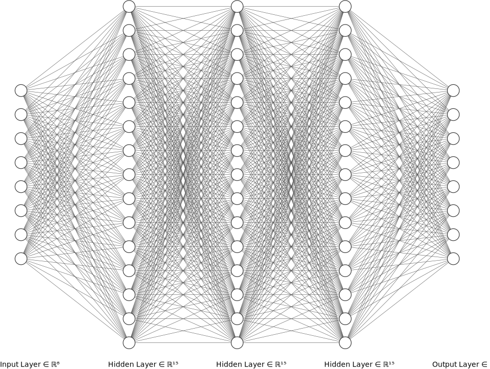

# Schnellstart 

Um den besten Einstieg mit dieser Library zu bieten, wird hier erläutert, wie man ein neuronales Netz initialisiert und es trainiert.

# Initialisierung 

Ein neuronales Netz wird durch den Konstruktor `HamsterNET` initialisiert. Die Methode benötigt folgende Argumente:

- `int[] neurons`
- `float learningRate`

Wobei `neurons` ein Array ist, wo die Länge der Anzahl der Layer und die einzelnen Werte die Anzahl der Neuronen in den Layern entspricht und learningRate einen Wert, der die schnelle des Lernen angibt.

```java
int neurons[] = {8, 15, 15, 15, 8};
HamsterNET net = new HamsterNET(neurons,0.7f);
```

Der obenstehende Audruck würde das folgende neuronale Netz erzeugen



# Trainieren

Um das generierte neuronale Netz zu trainieren, wird ein Datensatz benötigt, welcher in Form von zwei Arrays, `inputArray` und `outputArray`, in das Programm implementiert werden.

```java
// XOR Operationen 
```

Im folgenden wird gezeigt, wie man das neuronale Netz mit dem Datensatz trainiert.
Hierfür werden die zwei Methoden `computeOutput()` und `learn()` benötigt. Zuerst berechnen wir den momentanen Error-Wert und verbesseren diesen mit *backwardpropagation* (`learn()`)

```java 
int iterations = 500;
	for (int i=0;i < iterations ; i++)
		{
				for (int j=0 ; j < inputVector.length ; j++)
				{
						System.out.println("Iteration " + i + " Index " + j);
						net.computeOutput(inputVector[j]);
						net.learn(outputVector[j]);
					 
				}		 
}

```

# Das ganze Beispiel
```java
int neurons[] = {2, 15, 15, 15, 2};
HamsterNET net = new HamsterNET(neurons,0.7f);

// XOR Operationen 

int iterations = 500;
	for (int i=0;i < iterations ; i++)
		{
				for (int j=0 ; j < inputVector.length ; j++)
				{
						System.out.println("Iteration " + i + " Index " + j);
						net.computeOutput(inputVector[j]);
						net.learn(outputVector[j]);
					 
				}
			 
}
hamster.schreib("Done");	
```
